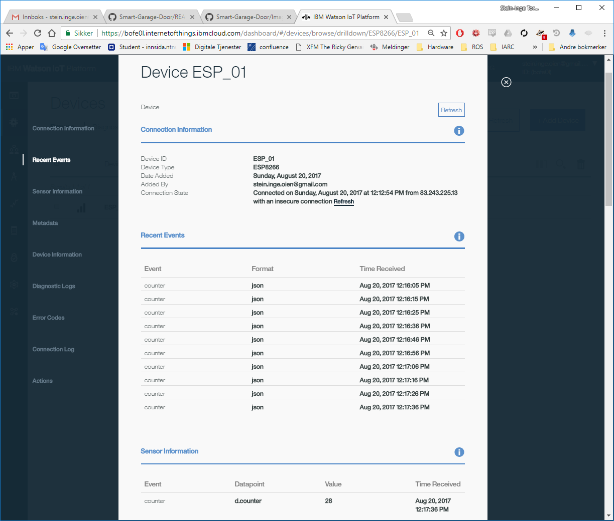
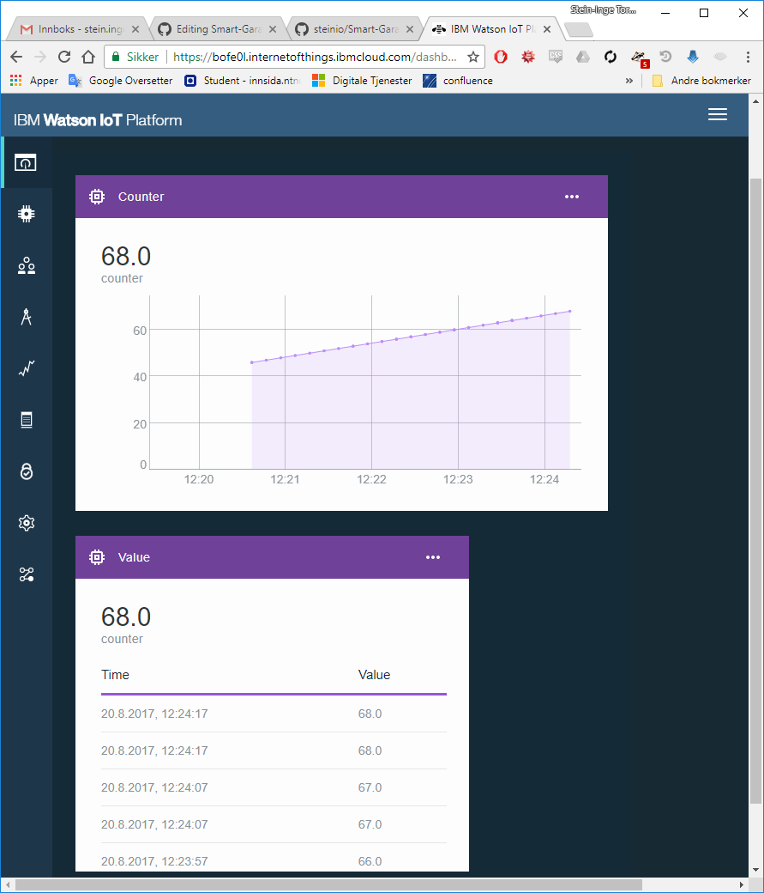
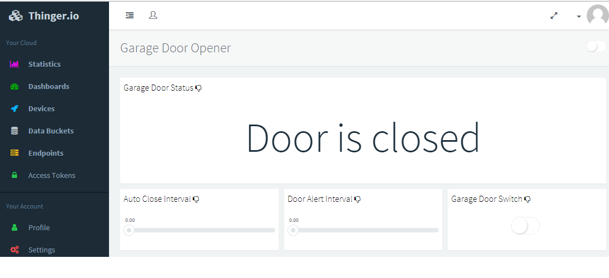

This project was spawned from myself always forgetting to close the garage door when leaving the house and when parking the car. 

The current garage door is opened and closed by an electric motor and is controlled by wireless switches (one in the car and one in the house), aswell as a wired switch inside the garage. The door is planned to be controlled  via the same input as the wired switch, which runs on 18V.

## Project Objective

The goal is the create a solution that automatically closes the garage door after I have left or come home. So some of the logic then revolves around cases such as 

- I have opened the door when the garage is empty.
- The garage door is open but there is movement inside the garage.
- The garage door is open and there is movement right outside of the garage.

### Planned Features

- To automatically open when the car is coming up the driveway (only my car).
- Remote control and monitoring on the web on both smart phone (app) and computer.
- License plate detection.

The project is ment to be an IoT, embedded and computer vision learning project for myself, while making something I can use in my daily life.

### Planned Hardware

- Raspberry Pi 3 B+
- Raspberry Pi Noir V2 Camera
- Low cost web camera
- Arduino nano/uno
- ESP8266
- Solid state relay
- Motion sensor
- Proximity sensor
- Humidity and temperature sensor (not needed, just because)

### Planned Software, Platforms and Languages

- IBM Bluemix
- Arduino IDE
- C (ESP8266 and Arduino)
- C++ (Raspberry Pi server application)
- Java (Android app)
- MQTT

The hardware for the project is still arriving from the hardworking republic of China, so stay tuned.

## Day 1: ESP8266 - Hello World

The components have all arrived, so now there are no more excuses.

First thing I did was to see if I could compile a simple program on the ESP8266, and get it connected to my WiFi, since this is the most important component in this project.

I decided to use the Arduino IDE to program the ESP8266, as this is the framework I am most experienced with.
To do this I first had to add the ESP9266 board by using the board manager in the Arduino IDE, by following the 3 steps below.

- Open the Preferences window.
- Enter the URL: [http://arduino.esp8266.com/stable/package_esp8266com_index.json](http://arduino.esp8266.com/package_esp8266com_index.json) into Additional Board Manager URLs field.
- Open Boards Manager from Tools > Board menu and install the ESP8266 platform.

After that I selected the Generic ESP8266, before uploading the code.
But to upload code, it needs to be connected to my computer somehow.

I connected the ESP8266 by using an FTDI, which is serial to usb, connected as shown below.


Just to be sure that the device actually works before uploading my own code, I tested the AT interface over serial to see if I could get a response.
This was done by opening the serial monitor and sending the string "AT\r\n", at 115200 baud rate.
I then received an "OK" message in response, meaning that everything was working.
We can now start writing and uploading our own code to the device.

When uploading new code the device has to be in bootloader mode, which is done by connecting the GPIO_0 pin to ground and powering the device off and on again.
To run the code after uploading, simply disconnect GPIO_0 from ground and power it off and on once more.

The WiFi test code I uploaded is quite simple, made possible by the ESP8266 wifi library.

```c_cpp
// Import ESP8266 wifi library
#include "ESP8266WiFi.h"

// WiFi parameters
char* ssid = "Windows 10 Update";
char* pwd = "DefNotAVirus";

void setup(void)
{ 
// Start Serial Connection
Serial.begin(115200);

// Connect to WiFi
WiFi.begin(ssid, pwd);
while (WiFi.status() != WL_CONNECTED) {
delay(500);
Serial.print(".");
}
Serial.println("");
Serial.println("WiFi connected");

// Print the IP address
Serial.println(WiFi.localIP());

}

void loop() {

}
```
When running, this printed out 
```
Wifi connected
192.168.1.245
```
## Day 2: ESP8266 with MQTT and IBM Bluemix - Hello World

Next step for me is to see that I can set up my ESP8266 and connect it to the IBM Watson IoT Platform.
Luckely for me, there is a how-to page for doing this on IBM's dev pages.

By following the instructions [here](https://developer.ibm.com/recipes/tutorials/connect-an-esp8266-with-the-arduino-sdk-to-the-ibm-iot-foundation/), I managed to set up my device rather quick and the entire process took less than 30 minutes.

The Hello World program just just a counter sending integers to IBM Watson IoT Platform by using the MQTT library for publishing and subscribing data in an easy way, as seen below.

```c_cpp
/**
 * Helloworld style, connect an ESP8266 to the IBM IoT Foundation
 * 
 * Author: Ant Elder
 * License: Apache License v2
 */
#include <ESP8266WiFi.h>
#include <PubSubClient.h> // https://github.com/knolleary/pubsubclient/releases/tag/v2.3

//-------- Customise these values -----------
char* ssid = "Altibox492434";
char* password = "64cLQu8J";

#define ORG "bofe0l1"
#define DEVICE_TYPE "ESP8266"
#define DEVICE_ID "ESP_01"
#define TOKEN "Qpu&dgdtznlpB2QDm51"
//-------- Customise the above values --------

char server[] = ORG ".messaging.internetofthings.ibmcloud.com";
char topic[] = "iot-2/evt/status/fmt/json";
char authMethod[] = "use-token-auth";
char token[] = TOKEN;
char clientId[] = "d:" ORG ":" DEVICE_TYPE ":" DEVICE_ID;

WiFiClient wifiClient;
PubSubClient client(server, 1883, NULL, wifiClient);

void setup() {
  Serial.begin(115200);
  Serial.println();

  Serial.print("Connecting to "); Serial.print(ssid);
  WiFi.begin(ssid, password);
  while (WiFi.status() != WL_CONNECTED) {
    delay(500);
    Serial.print(".");
  } 
  Serial.println("");

  Serial.print("WiFi connected, IP address: "); Serial.println(WiFi.localIP());
}

int counter = 0;

void loop() {

  if (!!!client.connected()) {
    Serial.print("Reconnecting client to ");
    Serial.println(server);
    while (!!!client.connect(clientId, authMethod, token)) {
      Serial.print(".");
      delay(500);
    }
    Serial.println();
  }

  String payload = "{\"d\":{\"counter\":";
  payload += counter;
  payload += "}}";
 
  Serial.print("Sending payload: ");
  Serial.println(payload);
 
  if (client.publish(topic, (char*) payload.c_str())) {
    Serial.println("Publish ok");
  } 
  else {
    Serial.println("Publish failed");
  }

  ++counter;
  delay(10000);
}
```
I had to modify the original "String payload = ..." code because it was missing escape characters and had unnecessary data.

After uploading the code and activating the device, I went to my IBM Bluemix Device Dashboard to find my device was connected.


By clicking on this device, I can see more information, like its last events and its payload.



For a prettier and fully customizable vizualization of the data, I created a new board with custom cards.



The next step for me now will be to use my IBM Bluemix Platform and connect a sensor to the ESP8266 and read this to the platform.
After that I will also try and subscribe to data, to be able to send data to the ESP8266 from the platform, enabling me to connect my smartphone or Raspberry Pi and communicating between them all, not only on the local network.

## Day 137: The return of the procrastinator
After day 2 I played abit with the bluemix framework and its mobile app, only to find that the mobile app wasn't able to connect directly with the IoT platform, which induced a tech depression, and I put some distance between me and this project.

Then after a while I saw my project lying in my closet, and I wondered why am I not finishing this project? Atleast the initial plan?
Well, the intial plan had some motion sensing involved, and wanting to make the first iteration as bare bone as possible I had to skip that and go for magnetic switch sensores instead, due to lack of IO on the ESP8266.

So I found a much easier IoT platform with alot less overhead than IBM Bluemix, AND with a functioning mobile app, also known as [thinger.io](http://thinger.io).

I registered an account, read the tutorials, and made my initial automatic garage door opener project.

This implementation will now 

- Open and close manually via web interface and mobile app.
- Monitor garaga door state (open or closed).
- Automatically close the garage door after having been open longer than a user specified time.
- Send an alarm to my email if the door has been open for longer than a user specified time.


I even got to use the EEPROM on the ESP8266, to store some initial values, in the event of a sudden reboot. Neat.

This code below is the first iteration, and I have already discovered some bugs and issues I want to improve. More on that later.

```c_cpp
#include <SPI.h>
#include <ESP8266WiFi.h>
#include <ThingerWifi.h>
#include <SimpleTimer.h>
#include <EEPROM.h> 

char* thingerUser = "MYUSERNAME";
char* myDeviceKey = "MYDEVICEKEY";
char* myDeviceName = "esp8266_1";
ThingerWifi thing(thingerUser, myDeviceName, myDeviceKey);

int MSW = 0;                          // Magnetic switch
int SW = 2;                           // Garage door opener switch

byte switchToggleDoorOpen = 0;
byte doorState= 0;                    // 1 = open, 2 = just closed, 3 = closed, 4 = just opened)"
byte prevDoorState = 0;               // 0 = "Open", 1 = "Closed"
byte currDoorState = 0;               // 0 = "Open", 1 = "Closed"
String doorStatus = "";               // "Door has been open for X min", "Door is closed"

unsigned int doorStartTime_ms = 0;
unsigned int doorTimeInterval_ms = 0;
unsigned int autoCloseTimer = 0;
byte autoCloseInterval = 0;

byte doorAlertInterval = 0;
unsigned long doorAlertTimer = 0;

SimpleTimer timer;
int doorStateTimerId;
int functionCallSpeed_ms = 100;

void setup(){

  EEPROM.begin(512);
  doorAlertInterval = EEPROM.read(0);
  autoCloseInterval = EEPROM.read(1);    
  
  pinMode(SW, OUTPUT);
  pinMode(MSW, INPUT_PULLUP);
  digitalWrite(SW, LOW);
  
  currDoorState = readDoorState();
  if (currDoorState == 1)
  {
    doorStartTime_ms = millis();
    doorStatus = "Open";
  }
  else
  {
    doorStatus = "Closed";
    doorTimeInterval_ms = 0;
  }
  delay(50);

  doorStateTimerId = timer.setInterval(functionCallSpeed_ms, checkDoorState);
  
  thing.add_wifi("Altibox492434", "64cLQu8J");
  
  thing["garageDoorSwitch"] << [](pson& sw)
  {
    if(sw.is_empty())
      sw = false;
    else
      toggle_switch();
  };
  
  thing["doorStatus"] >> [](pson& out)
  {
    out = doorStatus;
  };

  thing["autoCloseInterval"] << inputValue(autoCloseInterval,
  {
    autoCloseTimer = (doorTimeInterval_ms / 60000) + autoCloseInterval;
    EEPROM.write(1, autoCloseInterval);
    EEPROM.commit();   
  });
  
  thing["doorAlertInterval"] << inputValue(doorAlertInterval,{
    doorAlertTimer = (doorTimeInterval_ms / 60000) + doorAlertInterval;    
    EEPROM.write(0, doorAlertInterval);
    EEPROM.commit();  
  });

  thing["doorStatusTimeInterval"] >> [](pson& out)
  {
    String doorStatusTimeInterval;
    if (doorStatus == "Open")
    {      
       int seconds = doorTimeInterval_ms%60000;
       seconds = seconds/1000;
       doorStatusTimeInterval = String("Door has been OPEN for ") + (doorTimeInterval_ms / 60000) + String("m ") +  seconds + String("s");
    } 
    else if (doorStatus == "Closed")
    {
       doorStatusTimeInterval = String("Door is closed");
    }
    else
    {
       doorStatusTimeInterval = String("Door in unknown state");
    }
    out = doorStatusTimeInterval.c_str();
  };
}
void loop()
{
  timer.run();
  thing.handle();
}

void door_alert() 
{
    pson data;
    data["The garage door has been OPEN for"] = doorTimeInterval_ms / 60000;
    thing.call_endpoint("doorAlert", data);
}

void toggle_switch()
{
  digitalWrite(SW, HIGH);
  delay(500);
  digitalWrite(SW, LOW);  
}

byte readDoorState()
{
  if (digitalRead(MSW))
    return 0;
  else
    return 1;    
}

byte checkDoorState(byte x, byte y){
  byte state;  
  if (x != 0 && y != 0){
    state = 1;
  }
   if (x == 0 && y != 0){
    state = 2;
  }
   if (x == 0 && y == 0){
    state = 3;
  }
  if (x != 0 && y == 0){
    state = 4;
  }  
  return state;
}

void checkDoorState()
{
  prevDoorState = currDoorState;     
  currDoorState = readDoorState();
  doorState = checkDoorState(currDoorState, prevDoorState);
  switch (doorState) {
    case 1:
          doorTimeInterval_ms = (millis() - doorStartTime_ms);              
          if (autoCloseInterval != 0){                           
              if (doorTimeInterval_ms >= autoCloseTimer * 60000){
                  toggle_switch();
                  autoCloseTimer = (doorTimeInterval_ms / 60000) + autoCloseInterval;                                     
              }                                  
          }
          if (doorAlertInterval != 0){                           
              if (doorTimeInterval_ms >= doorAlertTimer * 60000){
                  door_alert();
                  doorAlertTimer = (doorTimeInterval_ms / 60000) + doorAlertInterval;                                     
              }                                  
          }          
          break;
    case 2:
          doorStatus = "Closed"; 
          doorTimeInterval_ms = 0;              
          autoCloseTimer = autoCloseInterval;
          doorAlertTimer = doorAlertInterval; 
          thing.write_bucket("garageBucket", "doorStatus");
          break;
    case 3:
          break;
    case 4:
          doorStartTime_ms = millis(); 
          doorStatus = "Open";                           
          thing.write_bucket("garageBucket", "doorStatus");
          break;    
  }  
}
```

I also made a simple Dashboard on my thinger userpage, so now I am able to control this controller from both my dashboard in a webbrowser and via the mobile app.



See you in another 137 days.
